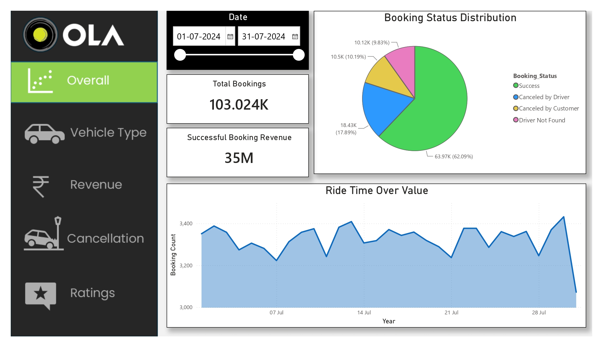
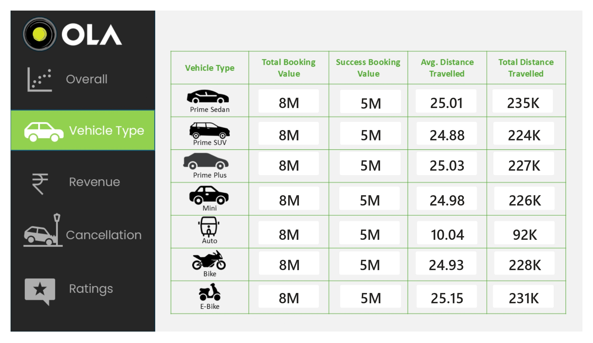
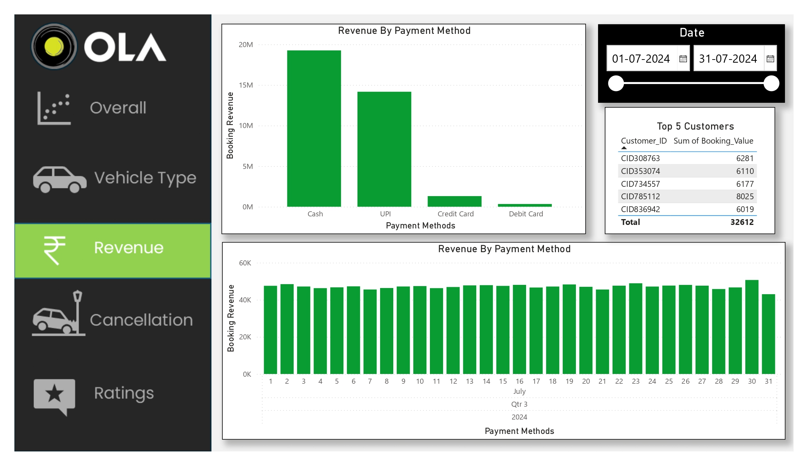
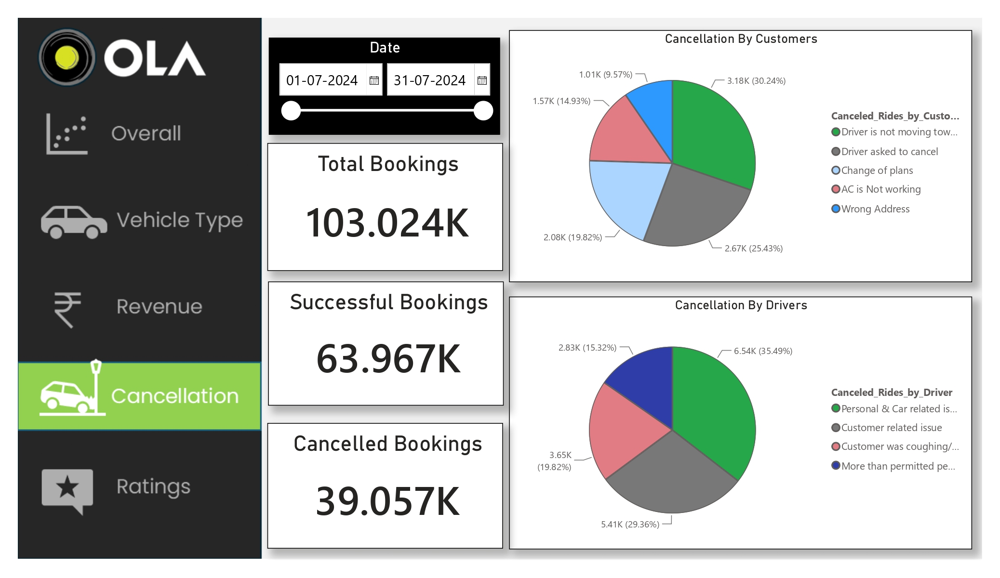
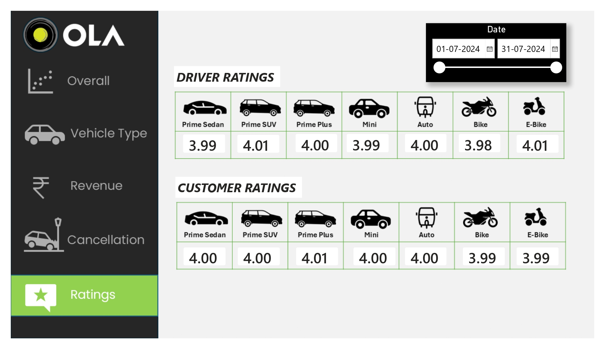

# 🚖 End-to-End OLA Ride Booking Analysis using Python & Power BI

## 📑 Table of Contents

- Project Overview
- Business Problem
- Dataset
- Tools Used
- Exploratory Data Analysis
- Power BI Dashboard
- Key Business Insights
- Dashboard Features
- Repository Structure
- Future Improvements
- Author

---

# 📌 Project Overview

This project presents an end-to-end analysis of OLA ride booking data using Python for Exploratory Data Analysis (EDA) and Microsoft Power BI for interactive dashboard creation.

The objective is to uncover booking trends, customer behavior, cancellation patterns, revenue performance, and operational insights that can help improve business decision-making.

---

# 🎯 Business Problem

Ride-hailing platforms generate thousands of bookings every day.

The challenge is to transform raw booking data into meaningful insights that help answer questions such as:

- How many rides are successfully completed?
- Which vehicle types generate the highest revenue?
- Why are rides getting cancelled?
- Which payment methods are most popular?
- How do customer ratings vary across vehicle categories?
- Which ride categories perform the best?

---

# 📂 Dataset

The dataset contains booking information including:

- Booking ID
- Booking Status
- Vehicle Type
- Ride Distance
- Ride Value
- Payment Method
- Customer Rating
- Driver Rating
- Cancellation Reason
- Booking Date & Time

---

# 🛠️ Tools Used

- Python
- Pandas
- NumPy
- Matplotlib
- Seaborn
- Microsoft Power BI

---

# 📊 Exploratory Data Analysis

Python was used to perform:

- Data Cleaning
- Missing Value Analysis
- Data Exploration
- Descriptive Statistics
- Trend Analysis
- Visualization
- Business Insight Generation

---

# 📈 Power BI Dashboard

The interactive Power BI dashboard provides:

- KPI Cards
- Booking Status Overview
- Revenue Analysis
- Vehicle Performance
- Cancellation Analysis
- Customer & Driver Ratings
- Payment Method Analysis
- Interactive Filters & Slicers

---

# 💡 Key Business Insights

- Identified the overall ride completion rate.
- Analyzed booking cancellation patterns.
- Compared revenue generated by different vehicle categories.
- Evaluated customer and driver ratings.
- Identified the most preferred payment methods.
- Highlighted operational areas requiring improvement.

---

# 📷 Dashboard Preview







---

# 📁 Repository Structure

```text
OLA-Ride-Booking-Analysis
│
├── README.md
├── Dataset
├── Python EDA
├── Dashboard
└── Screenshots
```

---

# 🚀 Future Improvements

- Build predictive demand forecasting models.
- Perform ride cancellation prediction.
- Analyze peak-hour demand.
- Deploy interactive dashboards online using Power BI Service.

---

# 👨‍💻 Author

**Shravan Kundap**

### Connect with me

- LinkedIn: https://www.linkedin.com/in/shravan-kundap-803a97292
- GitHub: https://github.com/ShravanK45

---

⭐ If you found this project useful, consider giving it a star!
